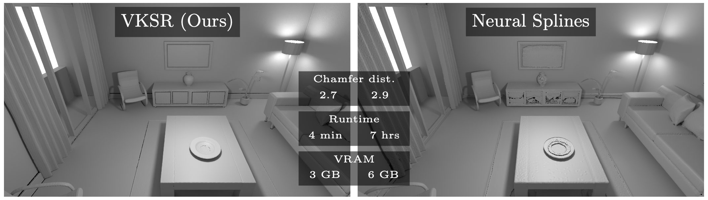

# VKSR: Scalable Kernel Surface Reconstruction Using Vecchia’s Approximation



**[Paper](https://media.eventhosts.cc/Conferences/ECCV2026/pdfs/8315.pdf) | [Project page](https://mweiherer.github.io/vksr/)** 

[Maximilian Weiherer](https://mweiherer.github.io), Chukwudi Williams Umah, [Bernhard Egger](https://eggerbernhard.ch)
Friedrich-Alexander-Universität Erlangen-Nürnberg

Official implementation of the paper "VKSR: Scalable Kernel Surface Reconstruction Using Vecchia’s Approximation", ECCV'26.

This repository contains the official implementation of VKSR, an efficient implicit surface reconstruction method that scales recent kernel-based techniques to dense and large-scale point clouds with millions of points.

Abstract:
*We propose Vecchia Kernel Surface Reconstruction (VKSR), an accurate implicit surface reconstruction method that efficiently scales recent kernel-based techniques to large point clouds with millions of points. While existing (global) kernel methods work well in a sparse setting, due to low-rank approximations, performance degrades quickly when presented with dense point clouds sampled from surfaces with high geometric complexity or large-scale inputs with millions of points. To overcome this limitation and inspired by the Gaussian Process literature, VKSR uses Vecchia’s approximation instead of low-rank approximations, which naturally shifts computation from a global to a local level and allows reconstructing 14M+ points in minutes. VKSR achieves state-of-the-art results on several challenging datasets while retaining kernel methods’ favorable properties when reconstructing sparse inputs.*

## Setup
We're using Python 3.9, PyTorch 2.8.0, and CUDA 12.8.
To install all dependencies within a conda environment, simply run:
```
conda env create -f environment.yaml 
conda activate vksr
```
This may take a while.


## Reconstructing a Point Cloud using VKSR
Example point clouds may be downloaded from [here](http://storage.googleapis.com/local-implicit-grids/demo_data.zip), kindly provided by the [Neural Splines](https://github.com/fwilliams/neural-splines) repository.


To reconstruct a surface mesh from an oriented point cloud (a point cloud that contains surface normals), type
```
python reconstruct.py <path-to-point-cloud> <k> <reg_weight>
```
with the following two *mandatory* parameters:

- `k`: The number of nearest neighbours. Choose larger values for sparse point clouds (we recommend setting $k=128$); use smaller values for dense point clouds (we recommend a range between $k=8$ and $k=128$). Larger $k$ lead to higher runtimes and memory consumption. Larger values are recommend for noisy point clouds. See also below.
- `reg_weight`: The regularization weight. The effect of regularization is more pronounced for larger values of $k$. Typical range is between $10^{-5}$ and $1$.

The following parameters are *optional*:
- `--chunk_size`: The size of the chunks the *query points* should be split into. Smaller values require less memory.  This does *not* affect the reconstruction quality! Default: `1000`.
- `--surf_eps`: The surface epsilon used to offset the input points. Ideally, this should be less than half the smallest distance between two points. Setting this value smaller than `0.5/voxel_resolution` (see below) is reasonable. Default: `0.05`.
- `--voxel_resolution_0`: The voxel resolution of the initial grid used during MISE. Default: `32`.
- `--num_upsampling_steps`: The number of upsampling steps performed during MISE. The final resolution is `voxel_resolution = voxel_resolution_0 * 2^num_upsampling_steps`. Default: `3` (final resolution of 256).
- `--trim`: The threshold used to trim away spurious geometry, if any. This distance is in voxels. Default: `0.0` (don't trim).
- `--knn_searcher`: The nearest neighbour search strategy. This can be either `exact_faiss` for exact nearest neighbours computed using the FAISS library, or `approximate_faiss` for approximate nearest neighbour search. Default: `approximate_faiss`. 
- `--nlist`: The number of centroids used during approximate nearest neighbour search (ignored if exact nearest neighbours are used). Higher values lead to more accurate results, but also an increased runtime. Default: `1000`.
- `--nprobe`: The number of probes (Voronoi cells) used during approximate nearest neighbour search (ignored if exact nearest neighbours are used). Higher values lead to more accurate results, but also an increased runtime. Default: `10`.
- `--kernel`: The kernel function used during reconstruction. Default: `matern` (we only support Matérn kernels as of now).
- `--order`: The order of the Matérn kernel. Choose either `1/2` (Laplace), `3/2`, `5/2`, or `inf` (Gaussian). Default: `1/2`.
- `--h`: The bandwidth of the Matérn kernel. Default: `1.0`.
- `--use_abs_units`: Enable this flag to use absolute values for `surf_eps` and `trim`. If not set, values are interpreted relative to the voxel size.
- `--device`: The device to run the reconstruction on. We recommend using a GPU; execution on the CPU may be slow depending on the parameter configuration. Default: `cuda`.

## Using VKSR in Python
VKSR can be directly used from within Python by importing the `vksr` module.
Please see `example_usage.py` for details.
 

## Citation
If you use VKSR, please cite
```bibtex
@inproceedings{weiherer2026vksr,
    title={VKSR: Scalable Kernel Surface Reconstruction Using Vecchia’s Approximation},
    author={Weiherer, Maximilian and Chukwudi, Williams Umah and Egger, Bernhard},
    booktitle={European Conference on Computer Vision},
    year={2026}
}
```
Also, in case you have any questions, feel free to contact Maximilian Weiherer.
